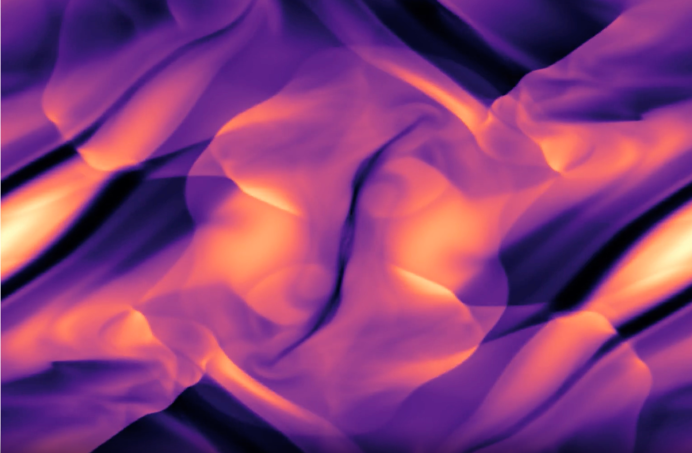
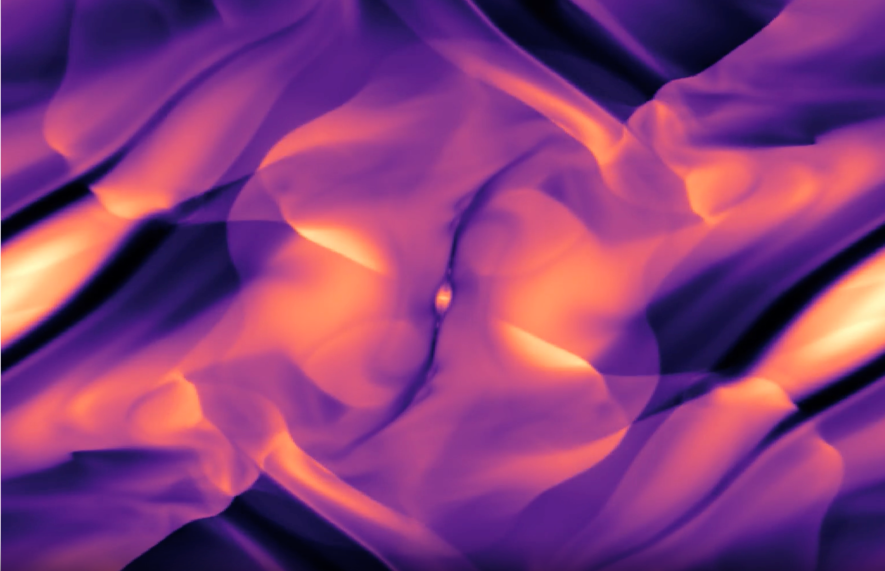
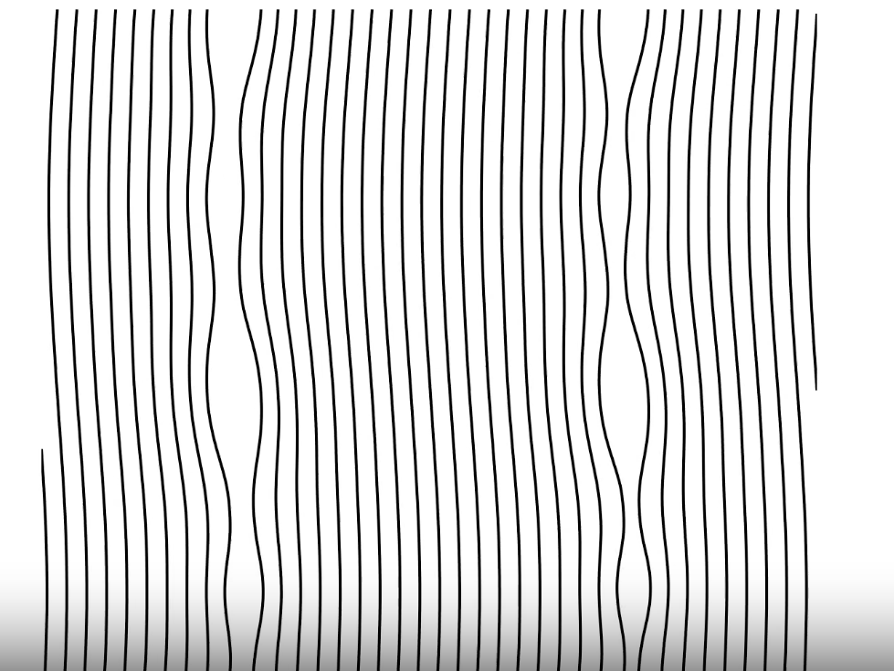
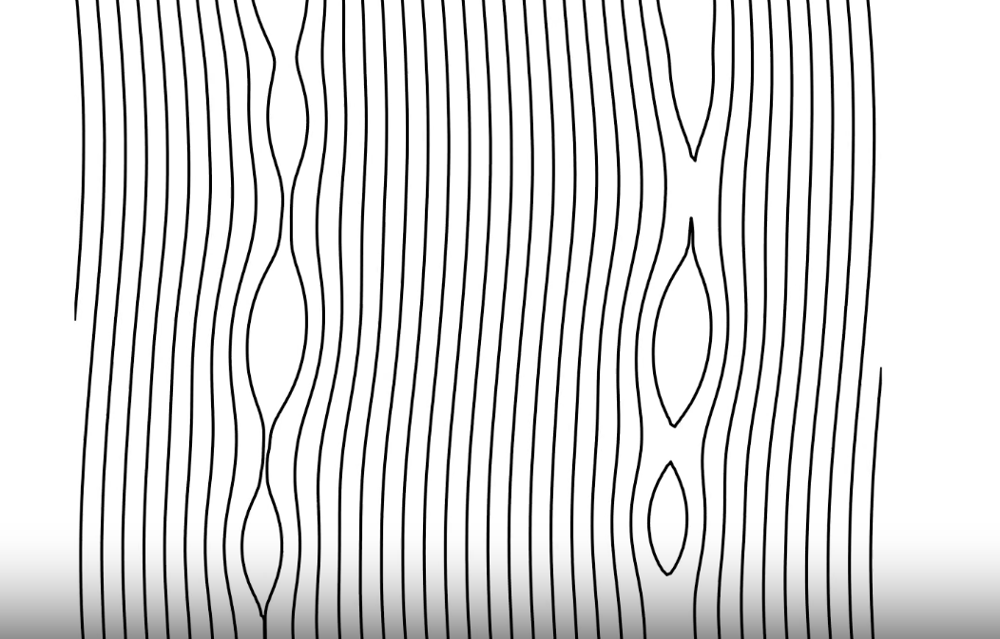
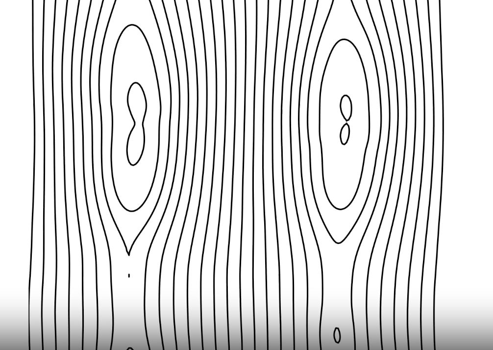
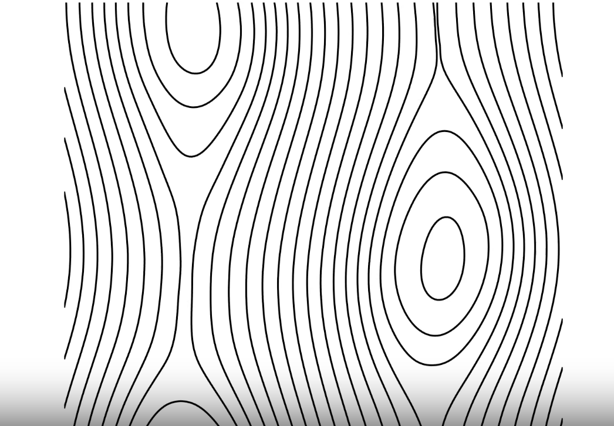
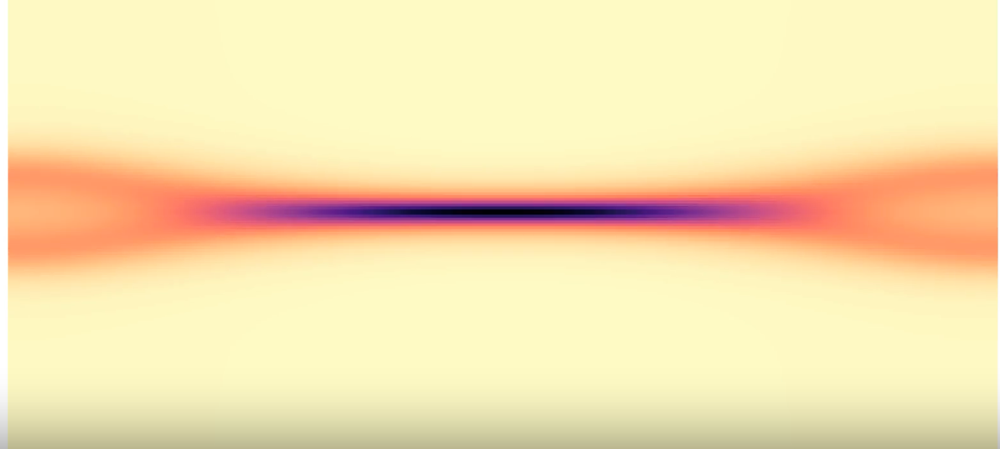
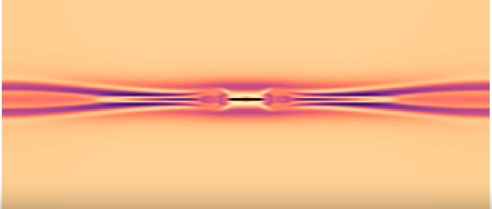

# LSC MAIN PROJECT: RESISTIVE MHD SOLVER
Built a 2D resistive MHD solver in C++ and investigated a range of standard tests that demonstrate magnetic reconnection

## Code Details
- Finite Volume Scheme using a HLLD (5 wave approximate Riemann) conservative flux update scheme
- Uses an additional generalised lagrange multipler (GLM) wave to enforce divergence clearing (divB=0)
- Performs explicit RK2 updates for resistive source terms with optional subcycling

## Orszag-Tang Vortex Test
- Small but finite resistivity (η) -> magnetic reconnection at domain centre
- Visible as formation and ejection of plasmoids
- At larger resistivities increased diffusivity suppresses this

<table>
  <tr>
    <td>
       
      
<em>Figure 1: Density plot for η=10^(-4) no plasmoid formation visible </em>

    </td>
    <td>
       
      
<em>Figure 2: Density plot for η=10^(-5) magnetic reconnection at centre visible</em>

    </td>
  </tr>
</table>

## Double Current Sheet
(https://www.astro.princeton.edu/~jstone/Athena/tests/current-sheet/current-sheet.html)
- Two initally stable current sheets interact leading to growing perturbations, magnetic reconnection and magnetic island formation.
<table>
  <tr>
    <td align="center">
      
    </td>
    <td align="center">
      
    </td>
  </tr>
  <tr>
    <td align="center">
      
    </td>
    <td align="center">
      
    </td>
  </tr>
</table>

<strong>Figure 3:</strong> Plots of magnetic field lines for double current sheet test.

## GEM Test
- Induces a tearing mode instability at the centre of a single equilibrated current sheet by applying a perturbing magnetic field.
- Results in magnetic reconnection and plasmoid ejection from the centre of the domain.

<table>
  <tr>
    <td align="center">
      
    </td>
  </tr>
  <tr>
    <td align="center">
      
    </td>
  </tr>
</table>

<strong>Figure 4:</strong> Plots of current density showing magnetic reconnection due to tearing mode.

  

